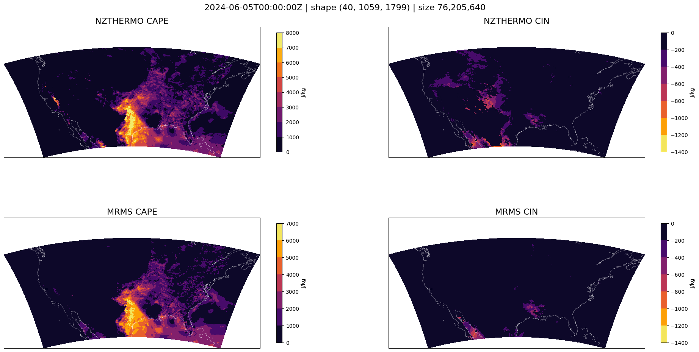
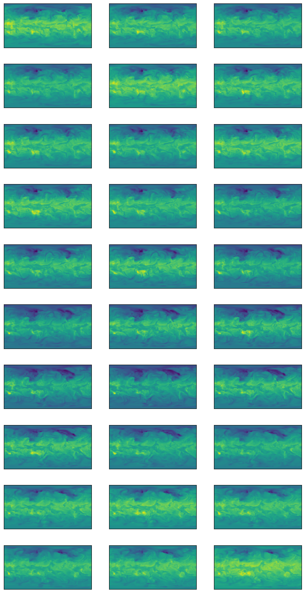

# nzthermo

This work has been heavily inspired by the excellent work and code base that has been developed by
the `MetPy` team. The concept of `(N, Z)` is simply to solve for `N` profiles of `Z` levels. So
regardless of what what you data looks like, if it can be reshaped to `(N, Z)` then it can be used
with this library. Where possible all iterations of `N` are run in parallel using `OpenMP` and
`Cython`.  Most of the root functions are written in `C++` and wrapped with `Cython` for use in
`Python`.

Where this code currently lacks in complete documentation it makes up for with the extensive and
verbose usage of type annotations. For example, the `parcel_profile` function is defined as follows:

```python
def parcel_profile(
    pressure: Pascal[np.ndarray[shape[Z], np.dtype[T]] | np.ndarray[shape[N, Z], np.dtype[T]]],
    temperature: Kelvin[np.ndarray[shape[N], np.dtype[np.float_]]],
    dewpoint: Kelvin[np.ndarray[shape[N], np.dtype[np.float_]]],
    /,
    *,
    step: float = ...,
    eps: float = ...,
    max_iters: int = ...,
) -> Kelvin[np.ndarray[shape[N, Z], np.dtype[T]]]: ...
```

Which make it quite clean that the pressure array is expected to be of shape `(Z,)` or `(N, Z)` and
have the units of `Pascal`. The temperature and dewpoint arrays are expected to be of shape `(N,)`
and have the units of `Kelvin`. The return value is expected to be of shape `(N, Z)` and have the
units of `Kelvin`.

## Getting Started

The C++ source code uses `templates` & `concepts` to support both `double` and `float` data types.
This requires when building from source that `-std=c++20` is available. If working from an older
version of Ubuntu you can update the default `c++` compiler as such.

```bash
sudo apt update -y
sudo apt install g++-10 -y
sudo update-alternatives --install /usr/bin/gcc gcc /usr/bin/gcc-10 60
```

The code can be installed into a virtual environment with the following commands.

```bash
python3.11 -m venv .venv
source .venv/bin/activate
pip install git+https://github.com/leaver2000/nzthermo@master
```

### Development

There are some additional tools that useful for development. These can be installed with the
`requirements.dev.txt` file.

```bash
pip install -r requirements.dev.txt
# dump the build directly into the src/ directory and generate the _version.py
pip install --no-deps --upgrade --target src/ .  
python setup.py build_ext --inplace
python setup.py clean --all build_ext --inplace
```

### functions

Unless otherwise specified, units are assumed `si` units.

#### moist_lapse

The `Cython` implementation of the `moist_lapse` function supports `pressure` arrays of shape
`(N,) | (Z,) | (1, Z) | (N, Z)`. The temperature array is raveled to a 1D array of shape `(N,)`.
`nan` values are ignored in the calculation of the moist adiabatic lapse rate, this can be useful in masking out levels for a particular profile.

If `reference_pressure` is not provided and the `pressure` array is 2D, the reference pressure
will be determined by finding the first non-nan value in each row.

```python
>>> pressure = np.array([
    [1013.12, 1000, 975, 950, 925, 900, ...],
    [1013.93, 1000, 975, 950, 925, 900, ...],
    [np.nan, np.nan, 975, 950, 925, 900, ...]
]) * 100.0 # (N, Z) :: pressure profile
>>> reference_pressure = pressure[np.arange(len(pressure)), np.argmin(np.isnan(pressure), axis=1)]
>>> reference_pressure
array([101312., 101393.,  97500.  ])
```

```python
import numpy as np
import metpy.calc as mpcalc
from metpy.units import units

import nzthermo as nzt
N = 1000
Z = 20

P = np.linspace(101325, 10000, Z)[np.newaxis, :] # (1, Z)
T = np.random.uniform(300, 200, N) # (N,)

ml = nzt.moist_lapse(P, T)
%timeit nzt.moist_lapse(P, T)
# 1.22 ms ± 142 µs per loop (mean ± std. dev. of 7 runs, 1,000 loops each)
P = P[0] * units.Pa
T = T * units.kelvin
ml_ = [mpcalc.moist_lapse(P, T[i]).m for i in range(N)]  # type: ignore
%timeit [mpcalc.moist_lapse(P, T[i]).m for i in range(1000)]
# 1.65 s ± 29.3 ms per loop (mean ± std. dev. of 7 runs, 1 loop each)
np.testing.assert_allclose(ml, ml_, rtol=1e-3)
```

#### lcl

```python
P = np.random.uniform(101325, 10000, 1000) # (N,)
T = np.random.uniform(300, 200, 1000) # (N,)
Td = T - np.random.uniform(0, 10, 1000) # (N,)

lcl_p, lcl_t = nzt.lcl(P, T, Td) # ((N,), (N,))
%timeit nzt.lcl(P, T, Td)
# 1.4 ms ± 373 µs per loop (mean ± std. dev. of 7 runs, 1,000 loops each)
P *= units.Pa
T *= units.kelvin
Td *= units.kelvin
lcl_p_, lcl_t_ = (x.m for x in mpcalc.lcl(P, T, Td))  # type: ignore
%timeit mpcalc.lcl(P, T, Td)
# 1.57 s ± 7.18 ms per loop (mean ± std. dev. of 7 runs, 1 loop each)
np.testing.assert_allclose(lcl_p, lcl_p_, rtol=1e-3)
np.testing.assert_allclose(lcl_t, lcl_t_, rtol=1e-3)
```

#### wet_bulb_temperature

#### CAPE CIN

```python
isobaric = xr.open_dataset(
    "hrrr.t00z.wrfprsf00.grib2",
    engine="cfgrib",
    backend_kwargs={"filter_by_keys": {"typeOfLevel": "isobaricInhPa"}},
)
surface = xr.open_dataset(
    "hrrr.t00z.wrfsfcf00.grib2",
    engine="cfgrib",
    backend_kwargs={"filter_by_keys": {"typeOfLevel": "surface", "stepType": "instant"}},
)
T = isobaric["t"].to_numpy()  # (K) (Z, Y, X)
Z, Y, X = T.shape
N = Y * X
T = T.reshape(Z, N).transpose()  # (N, Z)

P = isobaric["isobaricInhPa"].to_numpy().astype(np.float32) * 100.0  # (Pa)
Q = isobaric["q"].to_numpy()  # (kg/kg) (Z, Y, X)
Q = Q.reshape(Z, N).transpose()  # (N, Z)

Td = nzt.dewpoint_from_specific_humidity(P[np.newaxis], Q)

prof = nzt.parcel_profile(P, T[:, 0], Td[:, 0])

CAPE, CIN = nzt.cape_cin(P, T, Td, prof)

CAPE = CAPE.reshape(Y, X)
CIN = CIN.reshape(Y, X)


lat = isobaric["latitude"].to_numpy()
lon = isobaric["longitude"].to_numpy()
lon = (lon + 180) % 360 - 180
timestamp = datetime.datetime.fromisoformat(isobaric["time"].to_numpy().astype(str).item())

fig, axes = plt.subplots(2, 2, figsize=(24, 12), subplot_kw={"projection": ccrs.PlateCarree()})
fig.suptitle(f"{timestamp:%Y-%m-%dT%H:%M:%SZ} | shape {Z, Y, X} | size {Z*Y*X:,}", fontsize=16, y=0.9)

# I suspect that the difference between our cape calculations and the MRMS cape calculations is due
# to the fact we are not actually starting at the surface or accounting for surface elevation.
# leading to inflated cape values in areas of higher elevation.
cape = np.where(CAPE < 8000, CAPE, 8000)
cin = np.where(CIN > -1400, CIN, -1400)

for ax, data, title, cmap in zip(
    axes[0], [cape, cin], ["NZTHERMO CAPE", "NZTHERMO CIN"], ["inferno", "inferno_r"]
):
    ax.coastlines(color="white", linewidth=0.25)
    ax.set_title(title, fontsize=16)
    ax.set_global()
    ax.set_extent([lon.min(), lon.max(), lat.min(), lat.max()])
    cf = ax.contourf(lon, lat, data, transform=ccrs.PlateCarree(), cmap=cmap)
    plt.colorbar(cf, ax=ax, orientation="vertical", pad=0.05, label="J/kg", shrink=0.75)

MRMS_CAPE = surface["cape"].to_numpy()
MRMS_CIN = surface["cin"].to_numpy()
for ax, data, title, cmap in zip(
    axes[1], [MRMS_CAPE, MRMS_CIN], ["MRMS CAPE", "MRMS CIN"], ["inferno", "inferno_r"]
):
    ax.coastlines(color="white", linewidth=0.25)
    ax.set_title(title, fontsize=16)
    ax.set_global()
    ax.set_extent([lon.min(), lon.max(), lat.min(), lat.max()])
    cf = ax.contourf(lon, lat, data, transform=ccrs.PlateCarree(), cmap=cmap)
    plt.colorbar(cf, ax=ax, orientation="vertical", pad=0.05, label="J/kg", shrink=0.75)

```

[](assets/mrms_cape_cin.png)

#### dcape

```python
import numpy as np
import nzthermo as nzt
pressure = np.array(
    [1013, 1000, 975, 950, 925, 900, 875, 850, 825, 800, 775, 750, 725, 700, 650, 600, 550, 500, 450, 400, 350, 300],
) # (Z,)
pressure *= 100
temperature = np.array( 
    [
        [243, 242, 241, 240, 239, 237, 236, 235, 233, 232, 231, 229, 228, 226, 235, 236, 234, 231, 226, 221, 217, 211],
        [250, 249, 248, 247, 246, 244, 243, 242, 240, 239, 238, 236, 235, 233, 240, 239, 236, 232, 227, 223, 217, 211],
        [293, 292, 290, 288, 287, 285, 284, 282, 281, 279, 279, 280, 279, 278, 275, 270, 268, 264, 260, 254, 246, 237],
        [300, 299, 297, 295, 293, 291, 292, 291, 291, 289, 288, 286, 285, 285, 281, 278, 273, 268, 264, 258, 251, 242],
    ]
) # (N, Z)
dewpoint = np.array(
    [
        [224, 224, 224, 224, 224, 223, 223, 223, 223, 222, 222, 222, 221, 221, 233, 233, 231, 228, 223, 218, 213, 207],
        [233, 233, 232, 232, 232, 232, 231, 231, 231, 231, 230, 230, 230, 229, 237, 236, 233, 229, 223, 219, 213, 207],
        [288, 288, 287, 286, 281, 280, 279, 277, 276, 275, 270, 258, 244, 247, 243, 254, 262, 248, 229, 232, 229, 224],
        [294, 294, 293, 292, 291, 289, 285, 282, 280, 280, 281, 281, 278, 274, 273, 269, 259, 246, 240, 241, 226, 219],
    ]
) # (N, Z)
nzt.downdraft_cape(pressure, temperature, dewpoint) #(N,)
```

```python
import gcsfs
import numpy as np
import xarray as xr
import matplotlib.pyplot as plt

import nzthermo as nzt

# configure matplotlib
plt.rcParams["figure.figsize"] = (12, 8)
plt.rcParams["xtick.bottom"] = False
plt.rcParams["ytick.left"] = False
plt.rcParams["xtick.labelbottom"] = False
plt.rcParams["ytick.labelleft"] = False

# google cloud storage for access of large datasets
fs = gcsfs.GCSFileSystem(token="anon")
mapper = fs.get_mapper("gs://weatherbench2/datasets/era5/1959-2023_01_10-wb13-6h-1440x721_with_derived_variables.zarr")
ds = xr.open_zarr(mapper)

pressure = ds.coords["level"].to_numpy().astype(np.float32) * 100.0  # (hPa -> Pa) (13,)
temperature = ds["temperature"].isel(time=slice(0, 30)).to_numpy().astype(np.float32)  # (K) (30, 13, 721, 1440)
specific_humidity = ds["specific_humidity"].isel(time=slice(0, 30)).to_numpy().astype(np.float32) # (kg/kg) (30, 13, 721, 1440)

# - weatherbench's levels are in reverse order
# - non vertical dimensions are flattened like (T, Z, Y, X) -> (T*Y*X, Z) || (N, Z)
P = pressure[::-1]
Z = len(P)
T = np.moveaxis(temperature[:, ::-1, :, :], 1, -1).reshape(-1, Z)  # (N, Z)
Td = nzt.dewpoint_from_specific_humidity(
    P[np.newaxis, :],
    np.moveaxis(specific_humidity[:, ::-1, :, :], 1, -1).reshape(-1, Z),
)  # (K) (N, Z)
dcape = nzt.downdraft_cape(P, T, Td)  # (N,)
dcape = dcape.reshape((temperature.shape[0],) + temperature.shape[2:])  # (T, Y, X)
fig, axes = plt.subplots(dcape.shape[0] // 3, 3, figsize=(10, 20))
axes = axes.flatten()
for i, ax in enumerate(axes):
    ax.imshow(dcape[i], cmap="viridis")
```

[](assets/dcape.png)


### Testing

```bash
pytest tests
```

### Coverage

In order to compile the cython code for test coverage the code must be compiled with the `--coverage`
flag. This will enable the appropriate compiler flags and macros that allow for code coverage. This
also disables `openmp` which will cause the code to run significantly slower. Unit test can be run
without the `--coverage` flag but the coverage report will not be accurate.

```bash
python setup.py clean --all build_ext --inplace --coverage
coverage run -m pytest
coverage report -m

Name                     Stmts   Miss  Cover   Missing
------------------------------------------------------
nzthermo/__init__.py         3      0   100%
nzthermo/_c.pyx            112      7    94%   93-95, 196, 203, 222, 234
nzthermo/_typing.py         11      0   100%
nzthermo/const.py           32      0   100%
nzthermo/core.py           192     56    71%   61, 96, 141-142, 270, 283, 300-346, 387-417, 440-441, 458
nzthermo/functional.py     151     39    74%   31, 35, 38-39, 118-119, 132, 144-170, 182-189, 243, 275, 308, 310
------------------------------------------------------
TOTAL                      501    102    80%
```
